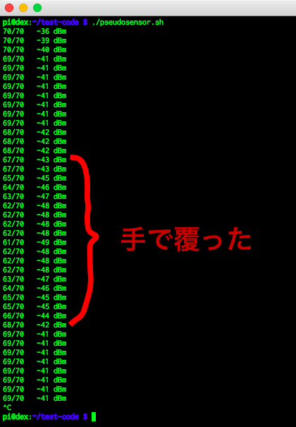
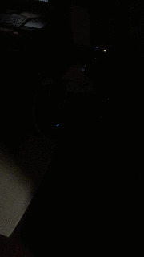

# Pseudo Motion Sensor

## Description

貧乏なので人感センサーを買えません。そこで考えたのが Wi-Fi の RSSI です。下図のように手で覆っただけで変化があります。下図は 1 sec 間隔のものですが 0.1 sec 間隔にするともっと精度が上がります。ラズパイと Wi-Fi AP の間を歩くだけの一瞬でも RSSI の減衰を取得できるので結構使えると個人的には思います。

個人個人それぞれの判定アルゴリズムを組み込めば、"ギリギリ" 人感センサーができます。異論は認めます。

なお、bash で sleep 0.1 とかすると無駄に CPU パワーを使うのでオススメしません。bash sleep なら 0.3 くらいがいいと思います。

## Sample 1

ある領域に侵入したら LED が光るようにしました。

